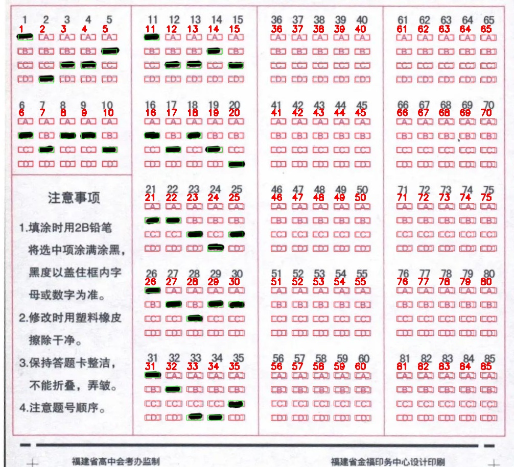

# CV_Lib（课程代码合集）

本仓库用于汇总计算机视觉课程各次课堂/作业代码与实验结果图。

## class3_openCV：答题卡自动识别与预处理（OpenCV 综合实战）

- **任务简介**：对拍摄/扫描的答题卡完成预处理（缩放、旋转矫正、核心区域定位裁剪、降噪、二值化、形态学处理等），并在核心区域上完成客观题涂卡识别与可视化叠加。
- **实现效果**：在提供的样张上实现 **识别准确率 100%**，并输出所有中间处理结果图与最终叠加图。

**最终效果图（答案框叠加）**：



## 运行方式（以 class3 为例）

进入 `class3_openCV` 后直接运行脚本即可：

```bash
python answer_card_process.py
```

也支持传入自定义图片路径：

```bash
python answer_card_process.py "你的答题卡图片路径"
```

> 依赖：`opencv-python`、`numpy`（见各 class 目录内说明）

